# Motion-Planning Gadget Simulation — Examples Report

_Auto-generated by `src/demo_simulations.py`. All figures and text below are produced by the verified tooling in `gadget.py`, `gadget_simulation.py`, `gadget_system.py`, and `gadget_viz.py`._

## 1. Background

Two relations are kept carefully distinct:

- **Equivalence** — do two gadgets admit exactly the same traversal sequences? Decided by `behaviorally_equivalent` (determinize → minimize → canonicalize, then compare), the authoritative notion of gadget identity.

- **Simulation** — can a *system* of one gadget reproduce another? We *refute* it soundly with composition invariants (`refute_simulation`), and we *confirm* it by building an explicit construction (`GadgetSystem`), computing the gadget it induces, and checking that against the target. A PASS is a genuine one-player simulation (the "if and only if"), because the induced gadget records **every** reachable external-to-external traversal — not a one-directional containment.

## 2. Reading the diagrams

- **State diagram**: one node per state; an edge `entry→exit` per traversal. A traversal whose exact reverse exists is drawn once as a blue `entry⇄exit` bidirectional edge (so reversible gadgets read cleanly).

- **State-location diagram**: the graph the agent literally walks — vertices are `(state, location)`, one arrow per traversal mode. The most faithful picture for hand-checking.

- **System diagram**: each instance is a boxed cluster of its ports; grey edges are wires; bold green boxes are the exposed external interface. A red overlay with numbered steps shows one traced traversal.

## 3. Single-gadget reference

The three building blocks used below. The **box** view is the paper-style picture (ports on the boundary, transitions inside, one line style per state); the state and state-location views are the abstract graphs.

### toggle (reversible)

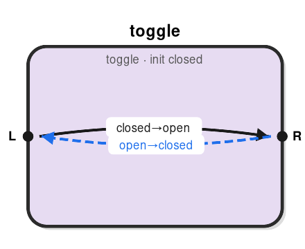

*toggle — box (ports on perimeter, transitions inside)*

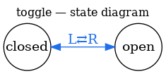

*toggle — state diagram*

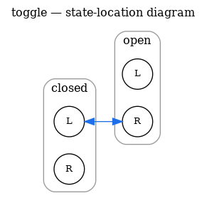

*toggle — state-location diagram*

### dicrumbler (irreversible, one-shot)

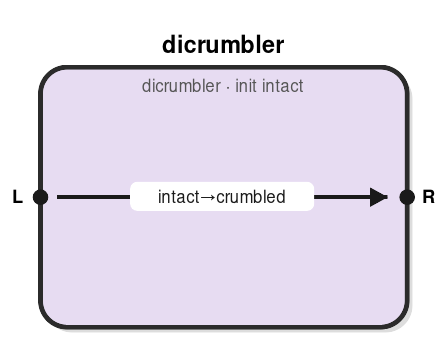

*dicrumbler — box*

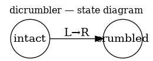

*dicrumbler — state diagram*

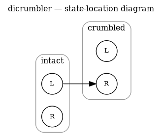

*dicrumbler — state-location diagram*

### seven (reversible, nondeterministic)

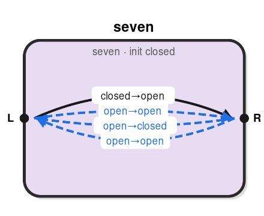

*seven — box*

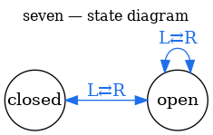

*seven — state diagram*

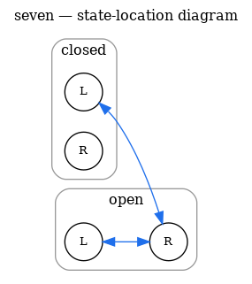

*seven — state-location diagram*

## 4. Equivalence & impossibility results

### 4.1 A toggle cannot simulate a dicrumbler (reversibility)

```
────────────────────────────────────────────────────────────
toggle      reversible?  True    DAG (bounded)?  False
dicrumbler  reversible?  False    DAG (bounded)?  True

Are they the same gadget?
  behaviorally_equivalent(toggle, dicrumbler) = False
  → No: the toggle has the reverse traversal the dicrumbler lacks.

Can a system of toggles simulate a dicrumbler?
Simulation is IMPOSSIBLE. Sound obstruction(s):
  - reversibility: the block is reversible but the target is not; any system of reversible gadgets is itself reversible, so it can never simulate an irreversible gadget

Conclusion: NO.  A system of reversible gadgets is reversible, so it
cannot simulate the irreversible dicrumbler — no construction exists.
```

### 4.2 A dicrumbler cannot simulate a toggle (DAG / boundedness)

```
────────────────────────────────────────────────────────────
Are they the same gadget?
  behaviorally_equivalent(dicrumbler, toggle) = False

Can a system of dicrumblers simulate a toggle?
Simulation is IMPOSSIBLE. Sound obstruction(s):
  - DAG/boundedness: the block has an acyclic state graph (bounded number of traversals) but the target's state graph has a cycle; a system of bounded gadgets is bounded and cannot simulate an unbounded target

Conclusion: NO.  A system of bounded (DAG) gadgets is bounded and
cannot reproduce the toggle's unbounded back-and-forth cycling.
```

### 4.3 seven vs toggle — invariants are silent

```
────────────────────────────────────────────────────────────
seven   reversible?  True    DAG (bounded)?  False
toggle  reversible?  True    DAG (bounded)?  False

Same gadget?  behaviorally_equivalent(seven, toggle) = False
  → No: seven adds two free-traverse modes in the open state.

Does any invariant refute "seven simulates toggle"?
No composition-invariant obstruction found (this does NOT prove a simulation exists).
Does any invariant refute "toggle simulates seven"?
No composition-invariant obstruction found (this does NOT prove a simulation exists).

Conclusion: the necessary conditions are silent here.  Whether
either simulates the other is not settled by these invariants and
would require an explicit construction (out of scope for this demo).
```

## 5. Verified constructions

### 5.1 Two toggles in series ⇒ a toggle

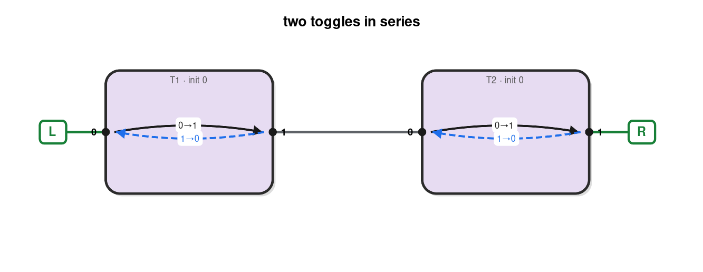

*two toggles in series — wiring*

```
────────────────────────────────────────────────────────────
Claim: two toggles wired in series simulate a single toggle.
  T1.R is wired to T2.L; external ports L = T1.L, R = T2.R.

Construction: 2 instance(s), 1 wire(s), external = ['L', 'R']
Induced gadget: 2 reachable config(s), 2 traversal mode(s).
  induced reversible? True   target reversible? True
  induced DAG?        False   target DAG?        False
Simulates target: True

Traces of every allowed traversal through the network:

From config (T1=0, T2=0) (induced state 0):
  ── traversal L → R ──
  enter external port L (= T1.0);  config (T1=0, T2=0)
  1. traverse T1: enter loc 0 → exit loc 1   (state 0→1);  config (T1=1, T2=0)
  2. walk wire T1.1 → T2.0
  3. traverse T2: enter loc 0 → exit loc 1   (state 0→1);  config (T1=1, T2=1)
  exit external port R (= T2.1);  config (T1=1, T2=1)

From config (T1=1, T2=1) (induced state 1):
  ── traversal R → L ──
  enter external port R (= T2.1);  config (T1=1, T2=1)
  1. traverse T2: enter loc 1 → exit loc 0   (state 1→0);  config (T1=1, T2=0)
  2. walk wire T2.0 → T1.1
  3. traverse T1: enter loc 1 → exit loc 0   (state 1→0);  config (T1=0, T2=0)
  exit external port L (= T1.0);  config (T1=0, T2=0)
```

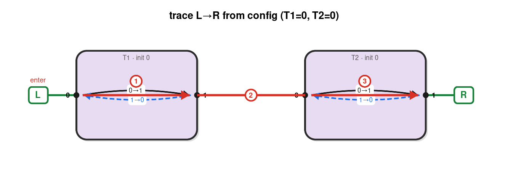

*trace L→R from (closed, closed)*

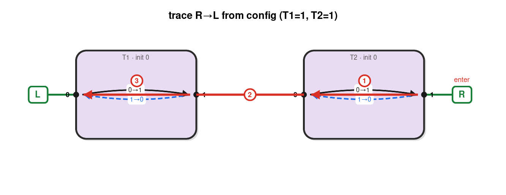

*trace R→L from (open, open)*

### 5.2 Three toggles in series ⇒ a toggle

The same idea scales; each traversal now threads all three toggles.

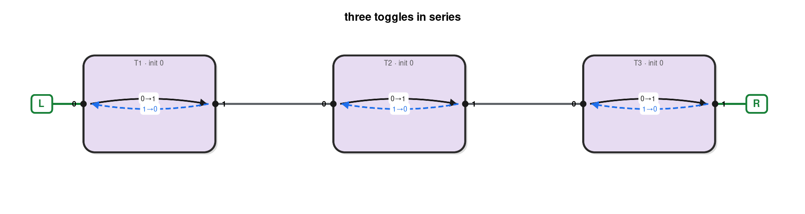

*three toggles in series — wiring*

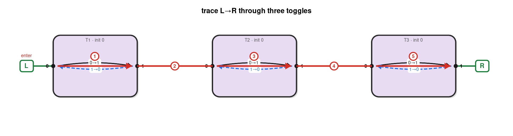

*trace L→R through three toggles*

```
────────────────────────────────────────────────────────────
Claim: three toggles in series simulate a single toggle.
  Each traversal now threads through all three toggles (5 steps).

Construction: 3 instance(s), 2 wire(s), external = ['L', 'R']
Induced gadget: 2 reachable config(s), 2 traversal mode(s).
  induced reversible? True   target reversible? True
  induced DAG?        False   target DAG?        False
Simulates target: True

From config (T1=0, T2=0, T3=0) (induced state 0):
  ── traversal L → R ──
  enter external port L (= T1.0);  config (T1=0, T2=0, T3=0)
  1. traverse T1: enter loc 0 → exit loc 1   (state 0→1);  config (T1=1, T2=0, T3=0)
  2. walk wire T1.1 → T2.0
  3. traverse T2: enter loc 0 → exit loc 1   (state 0→1);  config (T1=1, T2=1, T3=0)
  4. walk wire T2.1 → T3.0
  5. traverse T3: enter loc 0 → exit loc 1   (state 0→1);  config (T1=1, T2=1, T3=1)
  exit external port R (= T3.1);  config (T1=1, T2=1, T3=1)

From config (T1=1, T2=1, T3=1) (induced state 1):
  ── traversal R → L ──
  enter external port R (= T3.1);  config (T1=1, T2=1, T3=1)
  1. traverse T3: enter loc 1 → exit loc 0   (state 1→0);  config (T1=1, T2=1, T3=0)
  2. walk wire T3.0 → T2.1
  3. traverse T2: enter loc 1 → exit loc 0   (state 1→0);  config (T1=1, T2=0, T3=0)
  4. walk wire T2.0 → T1.1
  5. traverse T1: enter loc 1 → exit loc 0   (state 1→0);  config (T1=0, T2=0, T3=0)
  exit external port L (= T1.0);  config (T1=0, T2=0, T3=0)
```

### 5.3 Two dicrumblers in parallel ⇒ a two-use gadget

A genuinely non-trivial simulation. Both dicrumblers share the L and R junctions, so a single L→R traversal lets the agent **choose** which one to crumble (nondeterminism); the two "one crumbled" configurations behave identically and are merged by the equivalence check. The result is a gadget that may be traversed exactly twice.

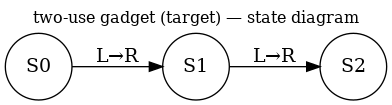

*two-use gadget (the target)*

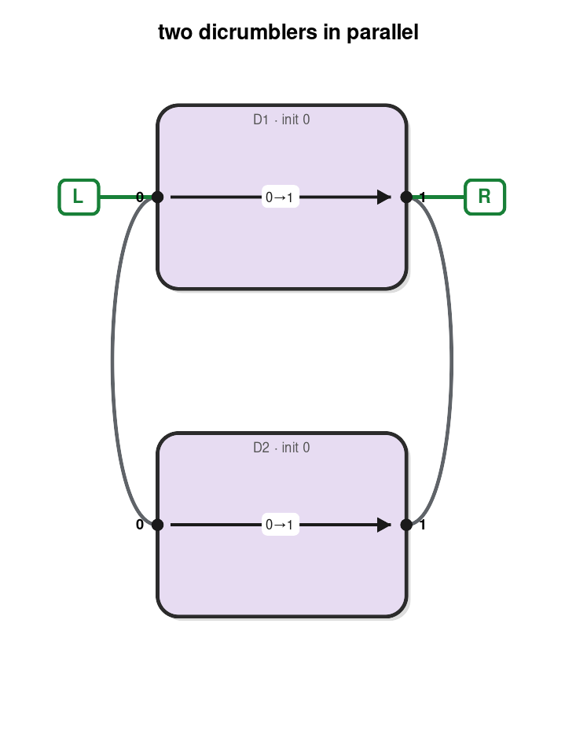

*two dicrumblers in parallel — wiring*

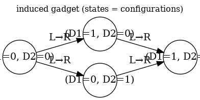

*induced gadget, states labelled by configuration*

```
────────────────────────────────────────────────────────────
Claim: two dicrumblers sharing both endpoints simulate a gadget that
crumbles after exactly TWO L→R traversals (a "two-use" gadget).
  D1.L,D2.L are joined as external L; D1.R,D2.R as external R.

Construction: 2 instance(s), 2 wire(s), external = ['L', 'R']
Induced gadget: 4 reachable config(s), 4 traversal mode(s).
  induced reversible? False   target reversible? False
  induced DAG?        True   target DAG?        True
Simulates target: True

The induced gadget has FOUR configurations, but (D1=1,D2=0) and
(D1=0,D2=1) are behaviorally identical ("one use left"), so the
equivalence check merges them — the simulated gadget has 3 states.

Traces of every allowed traversal (note the agent's choice from the
fresh configuration):

From config (D1=0, D2=0) (induced state 0):
  ── traversal L → R ──
  enter external port L (= D1.0);  config (D1=0, D2=0)
  1. traverse D1: enter loc 0 → exit loc 1   (state 0→1);  config (D1=1, D2=0)
  exit external port R (= D1.1);  config (D1=1, D2=0)
  ── traversal L → R ──
  enter external port L (= D1.0);  config (D1=0, D2=0)
  1. walk wire D1.0 → D2.0
  2. traverse D2: enter loc 0 → exit loc 1   (state 0→1);  config (D1=0, D2=1)
  3. walk wire D2.1 → D1.1
  exit external port R (= D1.1);  config (D1=0, D2=1)

From config (D1=1, D2=0) (induced state 1):
  ── traversal L → R ──
  enter external port L (= D1.0);  config (D1=1, D2=0)
  1. walk wire D1.0 → D2.0
  2. traverse D2: enter loc 0 → exit loc 1   (state 0→1);  config (D1=1, D2=1)
  3. walk wire D2.1 → D1.1
  exit external port R (= D1.1);  config (D1=1, D2=1)

From config (D1=0, D2=1) (induced state 2):
  ── traversal L → R ──
  enter external port L (= D1.0);  config (D1=0, D2=1)
  1. traverse D1: enter loc 0 → exit loc 1   (state 0→1);  config (D1=1, D2=1)
  exit external port R (= D1.1);  config (D1=1, D2=1)

From config (D1=1, D2=1) (induced state 3):
  (no traversals; dead configuration)
```

The two ways to make the first traversal (the agent's choice):

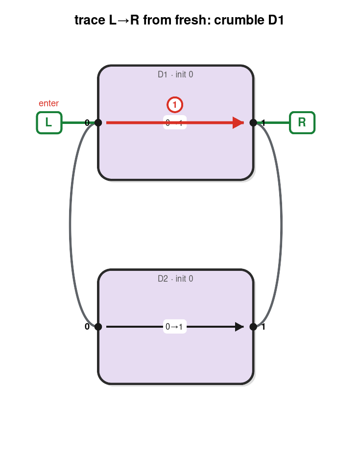

*first traversal: crumble D1*

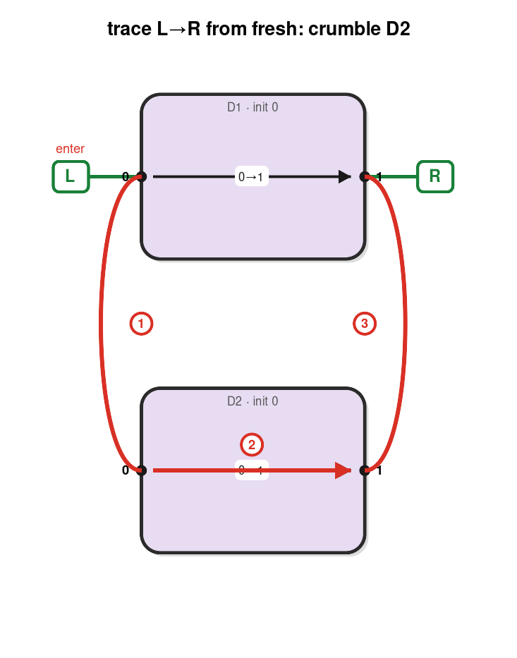

*first traversal: crumble D2*

### 5.4 Three dicrumblers in parallel ⇒ a three-use gadget

The construction generalizes: `k` parallel dicrumblers give a `k`-use gadget.

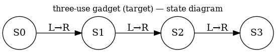

*three-use gadget (the target)*

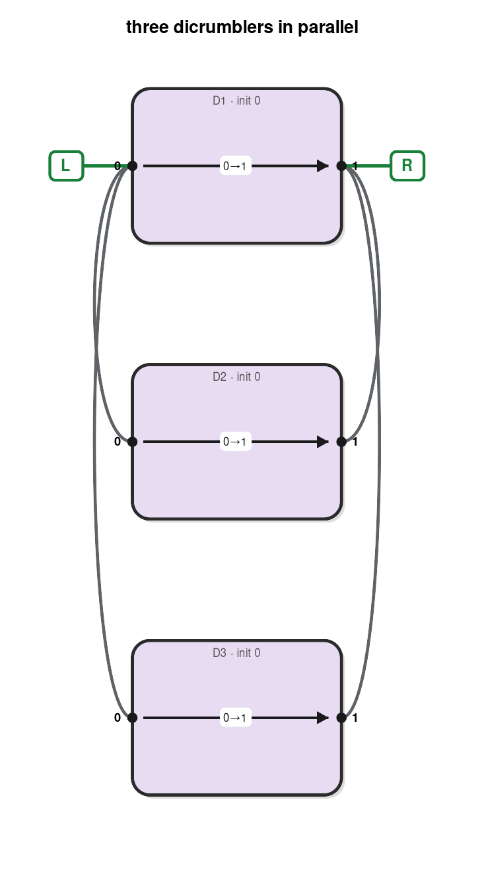

*three dicrumblers in parallel — wiring*

```
────────────────────────────────────────────────────────────
Claim: three dicrumblers in parallel simulate a THREE-use gadget.
  The pattern generalizes: k parallel dicrumblers ⇒ a k-use gadget.

Construction: 3 instance(s), 4 wire(s), external = ['L', 'R']
Induced gadget: 8 reachable config(s), 12 traversal mode(s).
  induced reversible? False   target reversible? False
  induced DAG?        True   target DAG?        True
Simulates target: True

Here the induced gadget has 2^3 = 8 configurations, which collapse to
the 4 states of the three-use gadget (grouped by how many dicrumblers
have crumbled).
```

## 6. Multi-port gadgets and more complex networks

Examples with three or more ports and richer topology than series/parallel bundles. The box view shows ports on the perimeter (cyclic order) with transitions inside; tunnels are laid out left/right.

### 6.1 A 2-toggle (4 ports) simulates a toggle

The 2-toggle has two tunnels sharing one state. Exposing only one tunnel leaves the other unreachable, so the result behaves as a single toggle.

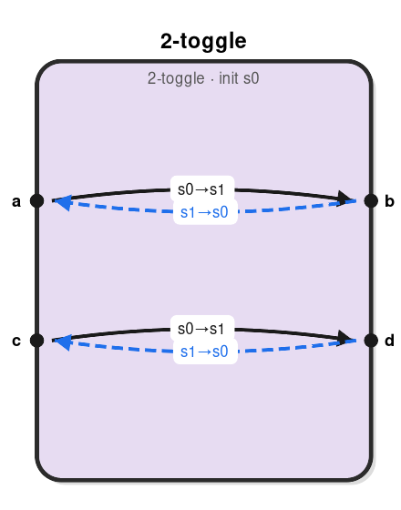

*2-toggle — box (two tunnels, shared state)*

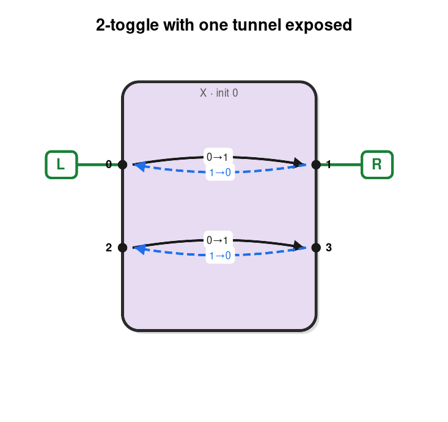

*only the (a,b) tunnel is exposed*

```
────────────────────────────────────────────────────────────
Claim: a 2-toggle simulates a toggle, using only its (a,b) tunnel.
  The (c,d) tunnel is left unconnected, so the agent never reaches it.

Construction: 1 instance(s), 0 wire(s), external = ['L', 'R']
Induced gadget: 2 reachable config(s), 2 traversal mode(s).
  induced reversible? True   target reversible? True
  induced DAG?        False   target DAG?        False
Simulates target: True

From config (X=0) (induced state 0):
  ── traversal L → R ──
  enter external port L (= X.0);  config (X=0)
  1. traverse X: enter loc 0 → exit loc 1   (state 0→1);  config (X=1)
  exit external port R (= X.1);  config (X=1)

From config (X=1) (induced state 1):
  ── traversal R → L ──
  enter external port R (= X.1);  config (X=1)
  1. traverse X: enter loc 1 → exit loc 0   (state 1→0);  config (X=0)
  exit external port L (= X.0);  config (X=0)
```

### 6.2 Two 2-toggles in series ⇒ a 2-toggle

A 4-port network joined by two internal wires (one per tunnel). The two gadgets stay synchronized, so the pair acts as a single 2-toggle.

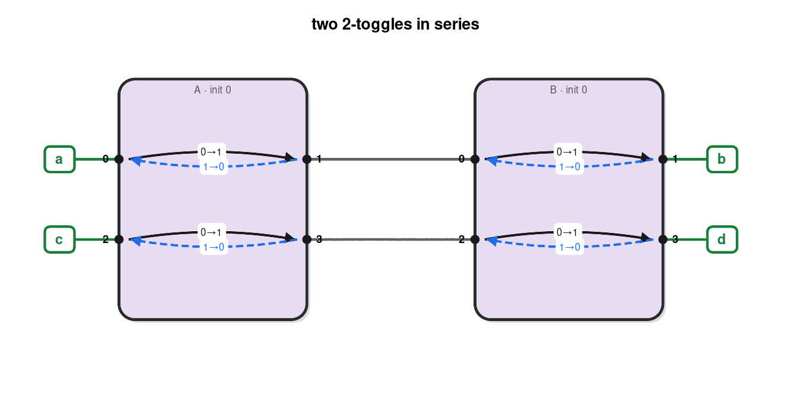

*two 2-toggles in series — wiring*

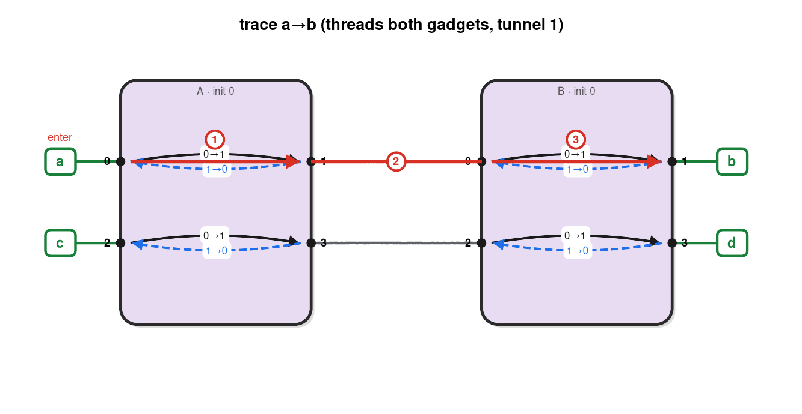

*trace a→b threads both gadgets*

```
────────────────────────────────────────────────────────────
Claim: two 2-toggles wired tunnel-to-tunnel simulate one 2-toggle.
  Internal wires A.b–B.a and A.d–B.c; external ports a,c (left) and
  b,d (right).  Every traversal threads both gadgets, keeping them
  synchronized, so only two joint configurations are reachable.

Construction: 2 instance(s), 2 wire(s), external = ['a', 'c', 'b', 'd']
Induced gadget: 2 reachable config(s), 4 traversal mode(s).
  induced reversible? True   target reversible? True
  induced DAG?        False   target DAG?        False
Simulates target: True

From config (A=0, B=0) (induced state 0):
  ── traversal a → b ──
  enter external port a (= A.0);  config (A=0, B=0)
  1. traverse A: enter loc 0 → exit loc 1   (state 0→1);  config (A=1, B=0)
  2. walk wire A.1 → B.0
  3. traverse B: enter loc 0 → exit loc 1   (state 0→1);  config (A=1, B=1)
  exit external port b (= B.1);  config (A=1, B=1)
  ── traversal c → d ──
  enter external port c (= A.2);  config (A=0, B=0)
  1. traverse A: enter loc 2 → exit loc 3   (state 0→1);  config (A=1, B=0)
  2. walk wire A.3 → B.2
  3. traverse B: enter loc 2 → exit loc 3   (state 0→1);  config (A=1, B=1)
  exit external port d (= B.3);  config (A=1, B=1)

From config (A=1, B=1) (induced state 1):
  ── traversal b → a ──
  enter external port b (= B.1);  config (A=1, B=1)
  1. traverse B: enter loc 1 → exit loc 0   (state 1→0);  config (A=1, B=0)
  2. walk wire B.0 → A.1
  3. traverse A: enter loc 1 → exit loc 0   (state 1→0);  config (A=0, B=0)
  exit external port a (= A.0);  config (A=0, B=0)
  ── traversal d → c ──
  enter external port d (= B.3);  config (A=1, B=1)
  1. traverse B: enter loc 3 → exit loc 2   (state 1→0);  config (A=1, B=0)
  2. walk wire B.2 → A.3
  3. traverse A: enter loc 3 → exit loc 2   (state 1→0);  config (A=0, B=0)
  exit external port c (= A.2);  config (A=0, B=0)
```

### 6.3 A branching network ⇒ a 3-port distributor

Two dicrumblers share an entry junction A with separate exits B and C. Entering A, the agent chooses which to crumble; each exit is available once, then the gadget is dead.

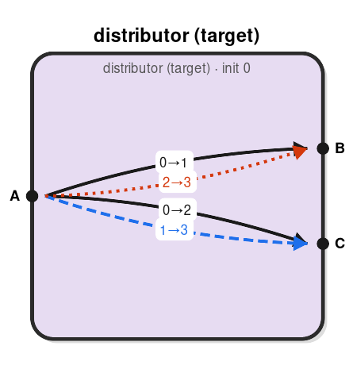

*distributor — box (3 ports)*

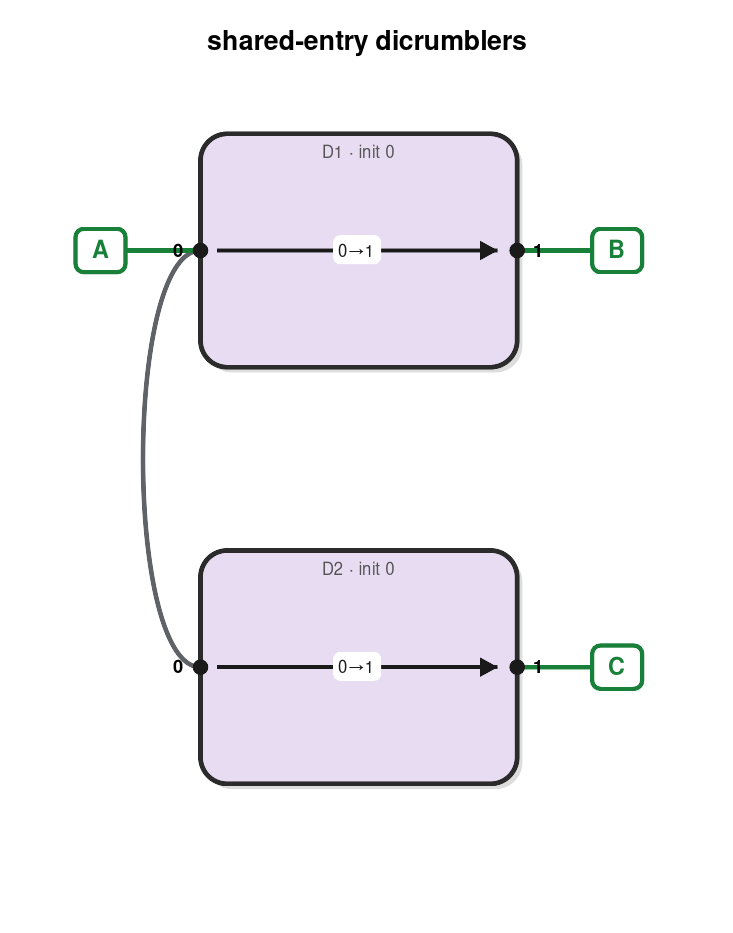

*shared-entry dicrumblers — wiring*

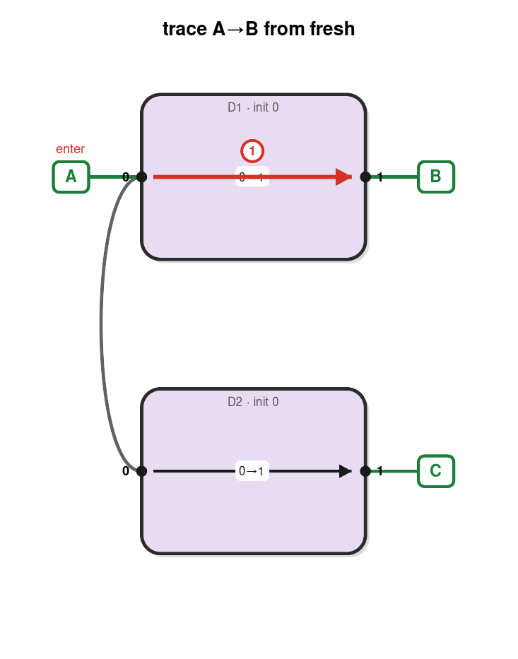

*trace A→B (crumble D1)*

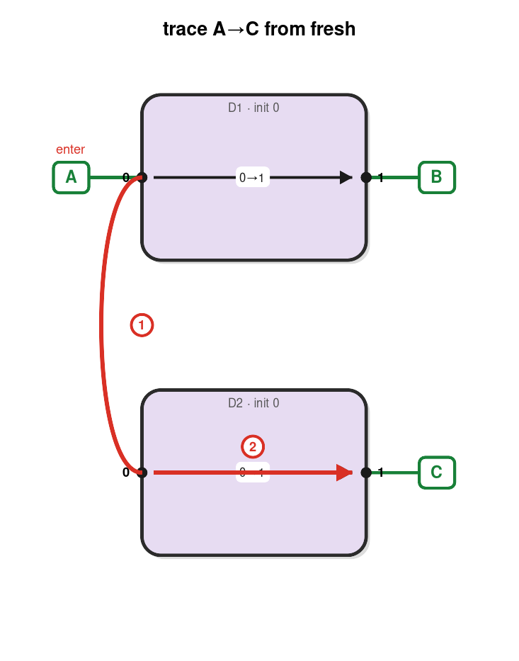

*trace A→C (route to D2)*

```
────────────────────────────────────────────────────────────
Claim: two dicrumblers sharing an entry junction simulate a 3-port
"distributor": enter A, exit B or C (agent's choice); each exit can
be produced once, then the gadget is dead.

Construction: 2 instance(s), 1 wire(s), external = ['A', 'B', 'C']
Induced gadget: 4 reachable config(s), 4 traversal mode(s).
  induced reversible? False   target reversible? False
  induced DAG?        True   target DAG?        True
Simulates target: True

From config (D1=0, D2=0) (induced state 0):
  ── traversal A → B ──
  enter external port A (= D1.0);  config (D1=0, D2=0)
  1. traverse D1: enter loc 0 → exit loc 1   (state 0→1);  config (D1=1, D2=0)
  exit external port B (= D1.1);  config (D1=1, D2=0)
  ── traversal A → C ──
  enter external port A (= D1.0);  config (D1=0, D2=0)
  1. walk wire D1.0 → D2.0
  2. traverse D2: enter loc 0 → exit loc 1   (state 0→1);  config (D1=0, D2=1)
  exit external port C (= D2.1);  config (D1=0, D2=1)

From config (D1=1, D2=0) (induced state 1):
  ── traversal A → C ──
  enter external port A (= D1.0);  config (D1=1, D2=0)
  1. walk wire D1.0 → D2.0
  2. traverse D2: enter loc 0 → exit loc 1   (state 0→1);  config (D1=1, D2=1)
  exit external port C (= D2.1);  config (D1=1, D2=1)

From config (D1=0, D2=1) (induced state 2):
  ── traversal A → B ──
  enter external port A (= D1.0);  config (D1=0, D2=1)
  1. traverse D1: enter loc 0 → exit loc 1   (state 0→1);  config (D1=1, D2=1)
  exit external port B (= D1.1);  config (D1=1, D2=1)

From config (D1=1, D2=1) (induced state 3):
  (no traversals; dead configuration)
```

## 7. A rejected construction

### 6.1 Two toggles in parallel — unfaithful

Sharing both endpoints of two toggles looks like it should give a toggle, but it does not: the verifier detects same-port traversals that change state (enter L, flip a toggle, return out L), which no gadget can express.

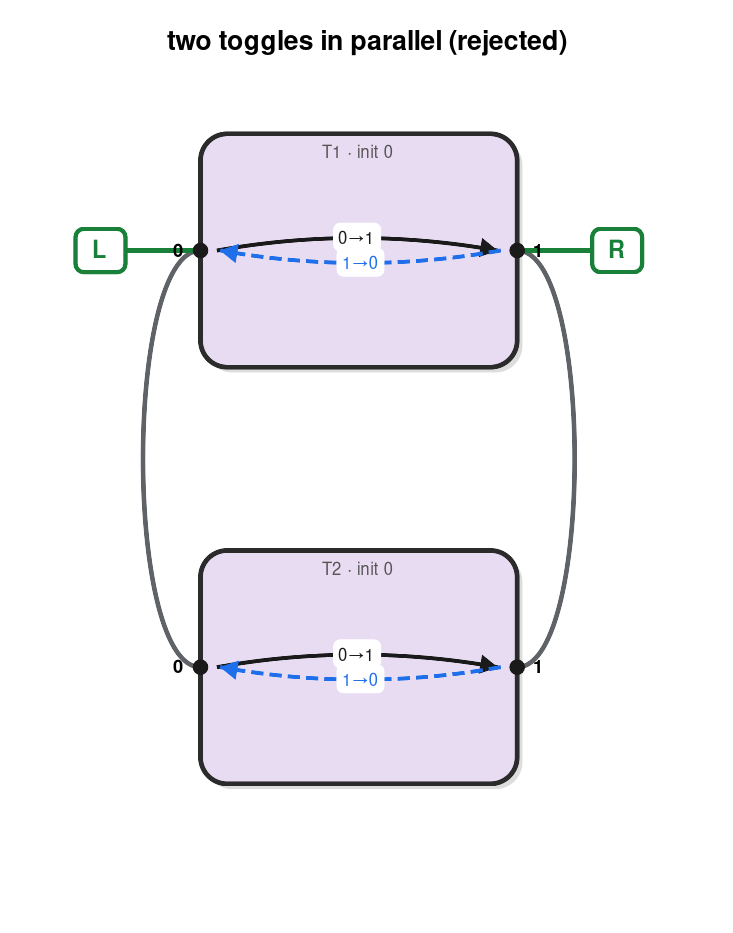

*two toggles in parallel (rejected)*

```
────────────────────────────────────────────────────────────
Claim (PLAUSIBLE BUT FALSE): two toggles sharing both endpoints
simulate a single toggle.

Construction: 2 instance(s), 2 wire(s), external = ['L', 'R']
Induced gadget: 4 reachable config(s), 8 traversal mode(s).
  induced reversible? True   target reversible? True
  induced DAG?        False   target DAG?        False
  DEFECT: 4 same-port traversal(s) that change state (extra behavior no gadget can represent):
    enter L in (T1=1, T2=0) can exit L in (T1=0, T2=1)
    enter R in (T1=1, T2=0) can exit R in (T1=0, T2=1)
    enter L in (T1=0, T2=1) can exit L in (T1=1, T2=0)
    enter R in (T1=0, T2=1) can exit R in (T1=1, T2=0)
Simulates target: False  (induced is NOT equivalent to target)

The construction is unfaithful: at the shared L junction the agent can
enter L, traverse one toggle to R, walk along the shared R junction back
into the OTHER toggle, and return to L — exiting where it entered with
the configuration changed.  No gadget has an "enter L, exit L, change
state" traversal, so the verifier reports these as defects.
```

## 8. Reproduce

```
/usr/bin/python3 src/demo_simulations.py
```

(The project `.venv` lacks graphviz; the system Python has it plus the `dot` binary. Tests: `python3 -m unittest test_gadget_simulation test_gadget_system` etc.)
